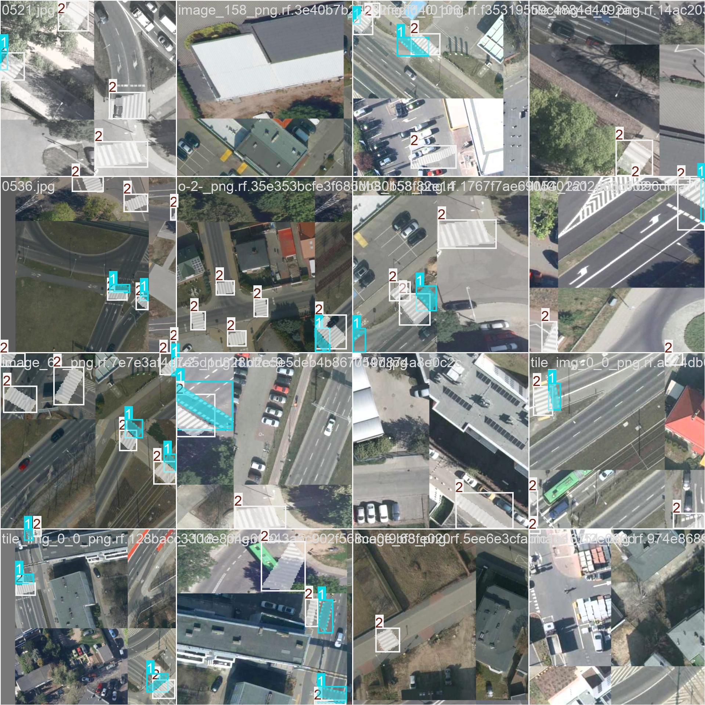

# ZPO_wykrywanie_pasow

Projekt dotyczący Zaawansowanego Przetwarzania Obrazów, gdzie głównym zadaniem było nauczenie modelu do wykrywania przejść dla pieszych i przejazdów rowerowych. Wykorzystany model do trenowania to YOLO 8 Segmentation.

## Dataset

Do realizacji projektu wykorzystano serię zdjęć pozyskanych za pomocą oprogramowania QGIS przy użyciu wtyczki Deepness. Następnie, obrazy te zostały zaimportowane do platformy Roboflow, gdzie przeprowadzono proces ich oznaczania. Na zdjęciach oznaczono przejazdy dla rowerów oraz przejścia dla pieszych, przypisując im odpowiednie etykiety: **bicycle_crossing** dla przejazdów rowerowych oraz **pedestrian_crossing** dla przejść dla pieszych.

## Procedura uczenia

### Przygotowanie danych

- Pobrane dane należy przygotować do procesu uczenia. W tym celu należy posegregować zdjęcia (JPG/PNG) oraz maski (PNG) w osobne zbiory. Do tego służy kod `segregate_images.py`. 
- Następnie zdjęcia należy przenieść do folderu: `data/images` i rozdzielić zbiór na dwa podzbiory: treningowy (`train`) oraz walidacyjny (`val`).
- Wyodrębnione maski należy umieścić we folderze `tmp/masks` i następnie uruchomić plik `masks_to_txt.py` w celu przekonwertowania maski na plik .txt.
- Trzeba zwrócić uwagę, czy plik .txt oraz odpowiadający mu plik .jpg, mają taką samą nazwę (np. Roboflow do każdej maski dodaje na końcu nazwy "_mask", dlatego w celu uniknięcia błędów z tym związanych należy uruchomić plik `change_name.py`)
- Przygotowane pliki .txt należy przenieść do folderu `data/labels` i rozdzielić zbiór na dwa podzbioru analogicznie jak to było robione w przypadku plików .jpg.
- Należy także utworzyć plik `config.yaml`, gdzie będą zdefiniowane klasy obiektów i podać ścieżkę zarówno do folderu trenującego (`train`) jak i walidacyjnego (`val`).

### Trening

- W celu wytrenowania modelu należy uruchomić plik `train_yolo.py`.
- Po treningu należy udać się do folderu runs/segment i odszukać folder z naszym wytrenowanym modelem. Domyślnie będzie to folder train+(numer treningu, np. train3). W tym folderze oprócz zapisanego modelu znajduje się także podsumowanie uczenia we formie różnych wykresów, heatmap, pliku .csv z danymi z każdej epoki oraz przykładowe zdjęcia ze zbioru treningowego i walidacyjnego wraz z predykcją przez model.

### Eksport modelu

- Aby wyeksportować nasz model do formatu .onnx należy w pliku `export_to_onnx.py` podać ścieżkę do naszego modelu np. `runs/segment/train1/weights/best.pt`.

Poniżej znajduje się link do zbioru danych, na których odbył się trening 3 (folder `runs/segment/train3`):

https://app.roboflow.com/zpo/pedestrian_bicycle_crossings/browse?queryText=&pageSize=50&startingIndex=0&browseQuery=true

## Wynik dla modelu 900_images.onnx

Poniżej przedstawiono rezultat uczenia modelu wytrenowanego na zbiorze danych przygotowanym przez nas.

Przykład serii zdjęć treningowych:

Przykład serii zdjęć walidacyjnych (labels):

Przykład serii zdjęć walidacyjnych (prediction):

## Wynik dla modelu best_ZPO.onnx

Poniżej przedstawiono rezultat uczenia modelu wytrenowanego na zbiorze danych przygotowanym przez studentów zajmujących się tym samym problemem.

Przykład serii zdjęć treningowych:

Przykład serii zdjęć walidacyjnych (labels):

Przykład serii zdjęć walidacyjnych (prediction):

## Porównanie wyników z QGIS

Poniżej znajdują się przykładowe wyniki, które zostały uzyskane za pomoca programu QGIS i wtyczki Deepness

<table>
  <tr>
    <td style="text-align: center; width: 50%;">
      
      
Przykładowy wynik dla modelu 900_images.onnx

    </td>
    <td style="text-align: center; width: 50%;">
      
      
Przykładowy wynik dla modelu best_ZPO.onnx

    </td>
  </tr>
</table>

## Podsumowanie

Analizując wykresy przedstawiające wyniki treningu dla modelu `900_images.onnx` i `best_ZPO.onnx` można zauważyć, że pierwszy model jest minimalnie dokładnieszy.
- W obu przypadkach straty (train i val) zmniejszają się w podobny sposób, jednak to model pierwszy lepiej optymalizuje się pod kątem strat (niższe wartości dla `box_loss` i `seg_loss`).
- Wartości `Precision` dla obu modeli oscylują w zakresie ~0.85-0.9 (dla obu klas B i M).
- Wartości `Recall` dla obu modeli oscylują w zakresie ~0.8-0.9 (dla obu klas B i M).
- Model `900_images.onnx` osiąga minimalnie wyższe wartości `mAP50` (~0.92) i `mAP50-95` (~0.7), co wskazuje, że radzi sobie lepiej w różnych progach IoU, a więc ma lepszą zdolność do generalizacji.
- Oba modele mają podobny stopień stabilności, chociaż w przypadku wyników walidacyjnych, pierwszy model ma mniejsze oscylacje.

#### Opcjonalne pliki

- `check_gpu.py` służy do sprawdzenia czy komputer ma możliwość skorzystania z karty graficznej do trenowania. Użycie GPU zamiast CPU wymagałoby zmiany kodu w pliku `train_yolo.py`.
- `convert_png_to_jpg.py` służy do konwersji plików .png do .jpg.

 

*Autorzy: Waszkowiak Michał, Woźniak Dawid*
